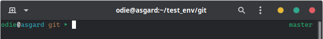

# ZSH Theme

This was built with the help of [Oh My Zsh](https://github.com/ohmyzsh/ohmyzsh)

## Screenshots

The terminal used in the screenshots is gnome-terminal

The Colorscheme used is [vimix-dark-laptop-doder](https://github.com/vinceliuice)

## Installation

### antigen

With [antigen](https://github.com/zsh-users/antigen) add

    antigen theme masterodie/zsh-theme-odie odie

before

    antigen apply
