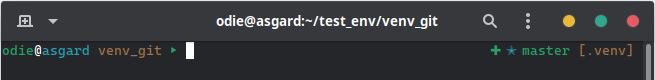

# ZSH Theme

This theme includes status indicators for git, python virtualenv, vi mode and a symbol indicating the exit status of the last run command.

This was built with the help of [Oh My Zsh](https://github.com/ohmyzsh/ohmyzsh)

## Screenshots

The terminal used in the screenshots is gnome-terminal

The Colorscheme used is [vimix-dark-laptop-doder](https://github.com/vinceliuice)

Last command was successful (exit code of 0)


Last command had an error (exit code not 0)


Git branch info


Python virtualenv info


Python virtualenv info and git with changes in repository


Vi-mode normal mode indicator


## Installation

### antigen

With [antigen](https://github.com/zsh-users/antigen) add something like this to `~/.zshrc`

```zsh
# load antigen
source ${HOME}/.zsh/antigen.zsh
#...
antigen use oh-my-zsh
# ...
antigen bundle git
antigen bundle virtualenv
antigen bundle vi-mode
# ...
antigen theme masterodie/zsh-theme-odie
# ...
antigen apply
# ...
VI_MODE_RESET_PROMPT_ON_MODE_CHANGE=true  # needed for vi-mode indicator to work correctly
```
